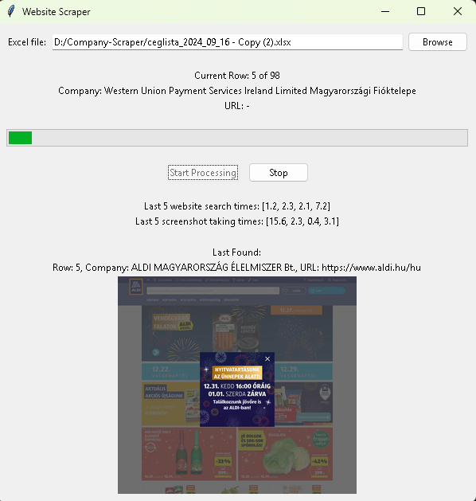

# Company Screenshot Scraper

A tool for automatically capturing screenshots of company websites. 

Currently using ScraperAPI, and [taso's search-engines library](https://github.com/tasos-py/Search-Engines-Scraper) as a search engine, and Playwright to create a screenshot.

## Features

- GUI interface for easy use (TKinter)
- Automatic cookie consent handling
- Fallback to multiple search engines if primary search fails
- Integration with ScraperAPI for more reliable results
- Smart URL filtering to identify official company websites
- Progress tracking and status updates
- Error handling and logging
- Screenshot organization by company/domain

Note: currently optimized for hungarian language, but can be easily extended to other languages.

## License

MIT License - See LICENSE file for details
